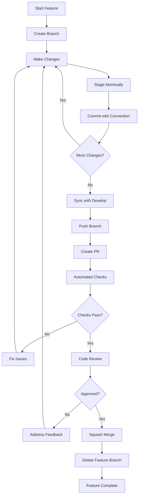

# 🎯 GraduateMatch Professional Git Flow

## Complete Implementation Summary

### 📋 Branch Strategy & Naming Conventions

| **Branch Type** | **Pattern** | **Purpose** | **Created From** | **Merged To** | **Lifetime** |
|-----------------|-------------|-------------|------------------|---------------|--------------|
| `main` | `main` | Production releases, stable code | N/A | N/A | **Permanent** |
| `develop` | `develop` | Integration branch, next release | `main` | `main` (via release) | **Permanent** |
| `feature` | `feature/<description>` | New features, enhancements | `develop` | `develop` | Temporary |
| `release` | `release/v<semver>` | Release preparation | `develop` | `main` + `develop` | Temporary |
| `hotfix` | `hotfix/<description>` | Critical production fixes | `main` | `main` + `develop` | Temporary |

### 🏷️ Conventional Commit Types

| **Type** | **Description** | **Example** | **When to Use** |
|----------|-----------------|-------------|-----------------|
| `feat` | New feature | `feat(auth): add OAuth integration` | Adding new functionality |
| `fix` | Bug fix | `fix(api): handle null user responses` | Fixing bugs or defects |
| `docs` | Documentation | `docs(readme): update installation guide` | Documentation changes |
| `style` | Code styling | `style(ui): fix button alignment` | Formatting, no logic change |
| `refactor` | Code refactoring | `refactor(auth): simplify token validation` | Code improvements |
| `perf` | Performance | `perf(db): optimize user query indexing` | Performance improvements |
| `test` | Testing | `test(auth): add login integration tests` | Adding/fixing tests |
| `build` | Build system | `build(docker): update Node.js to v20` | Build scripts, dependencies |
| `ci` | CI/CD | `ci(github): add automated testing workflow` | CI configuration |
| `chore` | Maintenance | `chore(deps): upgrade TypeScript to 5.3` | Routine maintenance |

### 🎯 Scopes for GraduateMatch Project

| **Scope** | **Description** | **Example Files** | **Use Cases** |
|-----------|-----------------|-------------------|---------------|
| `auth` | Authentication & Authorization | JWT middleware, login controllers | Authentication flows, security |
| `api` | Backend API Changes | REST endpoints, GraphQL resolvers | API modifications, new routes |
| `db` | Database & Data Layer | Migrations, entities, repositories | Schema changes, data operations |
| `matching` | Job Matching Algorithm | Scoring logic, recommendations | Algorithm improvements, ML models |
| `ui` | Frontend User Interface | React components, pages, layouts | UI components, user experience |
| `config` | Configuration Changes | Environment files, build configs | Setup, environment management |
| `deps` | Dependencies | package.json, lockfiles | Package updates, security patches |

### ⚛️ Atomic Commit Guidelines

| **Principle** | **✅ Good Example** | **❌ Bad Example** | **Why** |
|---------------|--------------------|--------------------|---------|
| **Single Concern** | `feat(auth): add password validation` | `fix various bugs and add feature` | Each commit should address one logical change |
| **Complete Change** | `feat(matching): implement job scoring`<br>- Add algorithm<br>- Add tests<br>- Update docs | `feat(matching): add algorithm` (missing tests) | Include all related parts of the feature |
| **Focused Scope** | `fix(ui): correct button styling on mobile` | `fix(ui): button styling + API changes` | Don't mix frontend and backend changes |
| **Meaningful Message** | `feat(auth): implement JWT refresh mechanism` | `update auth stuff` | Clear, descriptive commit messages |

### 🔧 Workflow Commands Reference

#### **Windows PowerShell**
| **Action** | **Command** | **Description** |
|------------|-------------|-----------------|
| Load Tools | `. .\scripts\git-workflow.ps1` | Load Git Flow functions |
| Start Feature | `gflow-feature user-authentication` | Create feature branch |
| Smart Staging | `gflow-add backend` | Stage backend changes only |
| Atomic Commit | `gflow-commit` | Commit with template validation |
| Sync Branch | `gflow-sync` | Sync with remote, rebase if needed |
| Finish Feature | `gflow-finish` | Create PR to develop |
| Check Status | `gflow-status` | Enhanced repository status |

#### **Linux/Mac Bash**
| **Action** | **Command** | **Description** |
|------------|-------------|-----------------|
| Load Tools | `source scripts/git-workflow.sh` | Load Git Flow functions |
| Start Feature | `gf_feature_start user-authentication` | Create feature branch |
| Smart Staging | `gf_add backend` | Stage backend changes only |
| Atomic Commit | `gf_commit` | Commit with template validation |
| Sync Branch | `gf_sync` | Sync with remote, rebase if needed |
| Finish Feature | `gf_feature_finish` | Create PR to develop |
| Check Status | `gf_status` | Enhanced repository status |

### 🎛️ Smart Staging Options

| **Target** | **Effect** | **Files Staged** |
|------------|------------|------------------|
| `backend` or `be` | Backend changes only | `apps/backend/` |
| `web` or `frontend` or `fe` | Frontend changes only | `apps/web/` |
| `docs` | Documentation only | `apps/docs/`, `*.md` |
| `packages` | Shared packages only | `packages/` |
| `config` | Configuration files | `*.json`, `*.yaml`, `*.yml`, `*.ts` |
| *(no argument)* | Interactive staging | Uses `git add --patch` |

### 📊 Quality Gates & Automation

| **Gate** | **Trigger** | **Validation** | **Action if Failed** |
|----------|-------------|----------------|---------------------|
| **Commit Message** | Every commit | Conventional commits format | Reject commit |
| **Branch Naming** | PR creation | Valid naming pattern | Block PR |
| **Atomic Analysis** | PR creation | File change analysis | Warning comments |
| **Build & Test** | PR/Push | Full CI pipeline | Block merge |
| **Code Review** | PR creation | Human approval required | Block merge |

### 🔄 Complete Feature Development Workflow



### 📁 File Structure Created

```
graduatematch/
├── .gitmessage                          # Commit message template
├── commitlint.config.js                 # Commit validation rules
├── setup-git-flow.sh                    # Unix setup script
├── setup-git-flow.ps1                   # Windows setup script
├── scripts/
│   ├── git-workflow.sh                  # Unix workflow functions
│   └── git-workflow.ps1                 # Windows workflow functions
├── docs/
│   ├── GIT_FLOW_STRATEGY.md            # Complete strategy guide
│   ├── GIT_FLOW_QUICKREF.md            # Quick reference
│   └── GIT_FLOW_IMPLEMENTATION.md       # This file
└── .github/workflows/
    └── git-flow-validation.yml          # Automated quality gates
```

### 🚀 Quick Start Commands

#### **1. Initialize the Git Flow**
```powershell
# Windows  
.\setup-git-flow.ps1

# Linux/Mac
chmod +x setup-git-flow.sh
./setup-git-flow.sh
```

#### **2. Load and Start Working**
```powershell
# Windows
. .\scripts\git-workflow.ps1
gflow-feature user-profile-management

# Linux/Mac  
source scripts/git-workflow.sh
gf_feature_start user-profile-management
```

#### **3. Professional Development Cycle**
```bash
# Make changes to backend
gflow-add backend
gflow-commit
# Message: "feat(user): add profile update service"

# Add comprehensive tests
gflow-add backend  
gflow-commit
# Message: "test(user): add profile service validation tests"

# Add frontend UI
gflow-add ui
gflow-commit
# Message: "feat(ui): add profile management interface"

# Finish and create PR
gflow-finish
```

---

## 🎯 Success Metrics

✅ **Readable History**: Every commit tells a clear story  
✅ **Reversible Changes**: Easy rollbacks with atomic commits  
✅ **Collaborative**: Clear branching for team development  
✅ **Automated Quality**: Consistent standards enforcement  
✅ **Scalable Process**: Tools grow with team size  

This implementation transforms ad-hoc commits into a professional, enterprise-grade version control strategy that enables confident releases, collaborative development, and maintainable project history.